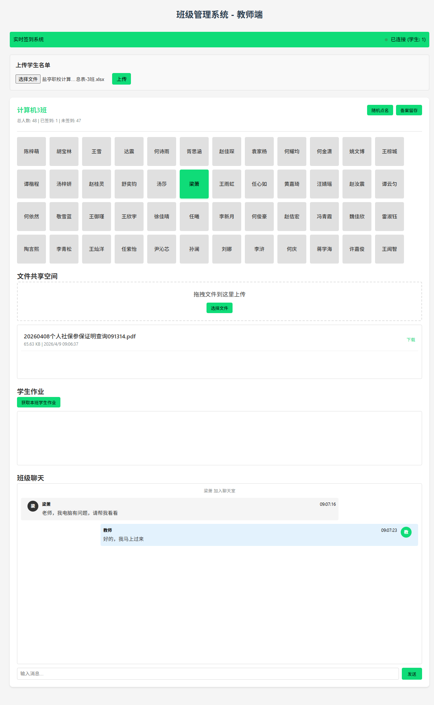
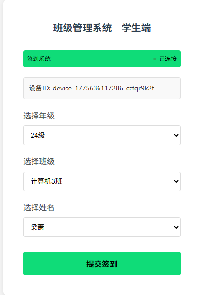
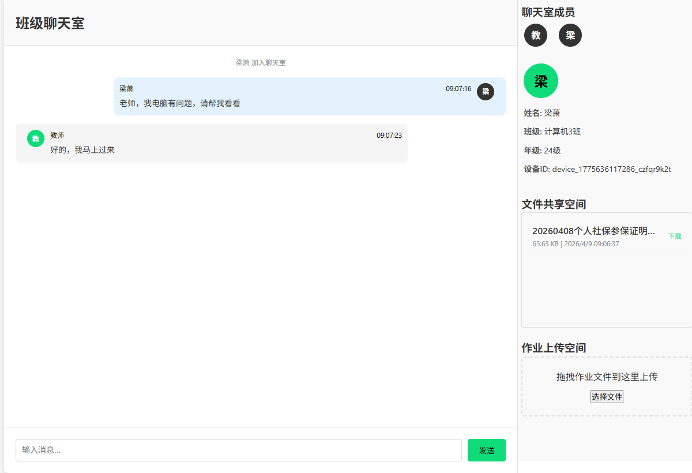

# 机房班级管理系统

一个不使用任何前端框架的机房管理系统（Pure JavaScript, By Websocket）

## 功能

- 实时监控连接学生电脑状态
- 动态上传学生及班级信息(excel)
- 随机抽查点名
- 学生签到及备案留存
- 班级文件共享
- 班级聊天室
- 学生作业提交

## 效果图

## 项目构建

- student.html、teacher.html均修改 `WEBSOCKET_SERVER`为教师机的IP地址
- 教师机启动项目`npm run dev`
- 教师机分发student.html给学生电脑
- 教师机访问teacher.html、学生机访问student.html

## 技术栈

- HTML5
- CSS3
- JavaScript
- WebSocket